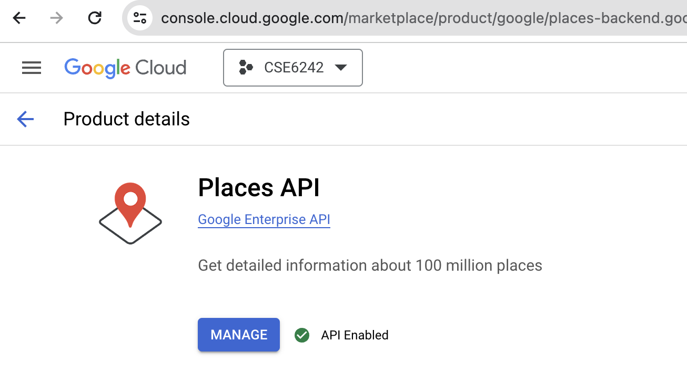
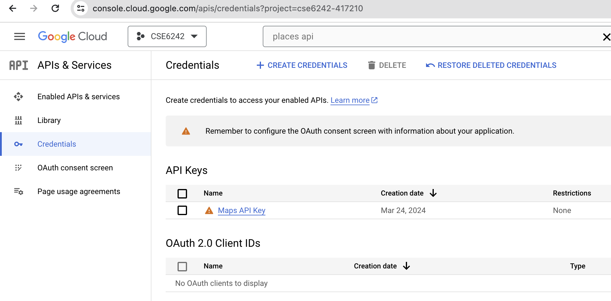

# Restaurant data from Google Places API

## Setup
1. Find Places API on https://console.cloud.google.com
2. Enable the API


3. From the navigation menu, select APIs & Services, and click + create credentials button.



## Code
- ```tract_centroids.csv```: centroids distributed evenly over Manhattan borough.
- ```get-restaurants-with-centroids.py```: fetch the restaurant data from API, and save as json(restaurants.json). 
- ```json-to-csv.py```: transform the json file(restaurants.json) to csv file(restaurants.csv)


### get-restarutants-with-centroids.py
Copy and paste the credential key as parameter of Client getter function before run this code.
```
import googlemaps
gmaps = googlemaps.Client(key='AI...CREDENTIAL KEY HERE')
```

This code get some data fields from Places API(ex, ratings, num_of_ratings, lat, lng, ..).
All the fields available on Places API are here: Google places data fields: https://developers.google.com/maps/documentation/places/web-service/place-data-fields, or https://developers.google.com/maps/documentation/places/web-service/details


## Run the code
```
python get-restaurants-with-centroids.py # fetch from Google Place API and save as restaurants.json
python json-to-csv.py # read restaruants.json and save as restaurants.csv
```


## restaurants.csv

| column name        | description                                                                                                   | source     |
| ------------------ | ------------------------------------------------------------------------------------------------------------- | ---------- |
| neighborhood       | the neighborhood name in plain text                                                                           | Places API |
| name               | the name of restaurant                                                                                        | Places API |
| place_id           | restaurant's places id in Places API                                                                          | Places API |
| price_level        | 0 Free, 1 Inexpensive, 2 Moderate, 3 Expensive, 4 Very Expensive                                              | Places API |
| rating             | rating of the restaurant                                                                                      | Places API |
| user_ratings_total | total number of users who rated the restaurant                                                                | Places API |
| business_status    | currently running or not, The allowed values include: OPERATIONAL, CLOSED_TEMPORARILY, and CLOSED_PERMANENTLY | Places API |
| adr_address        | A representation of the place's address in the adr microformat.                                               | Places API |
| formatted_address  | A string containing the human-readable address of this place.                                                 | Places API |
| lat                | lattitude                                                                                                     | Places API |
| lng                | longitude                                                                                                     | Places API |